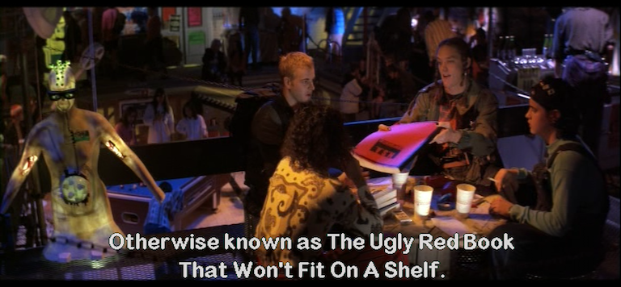
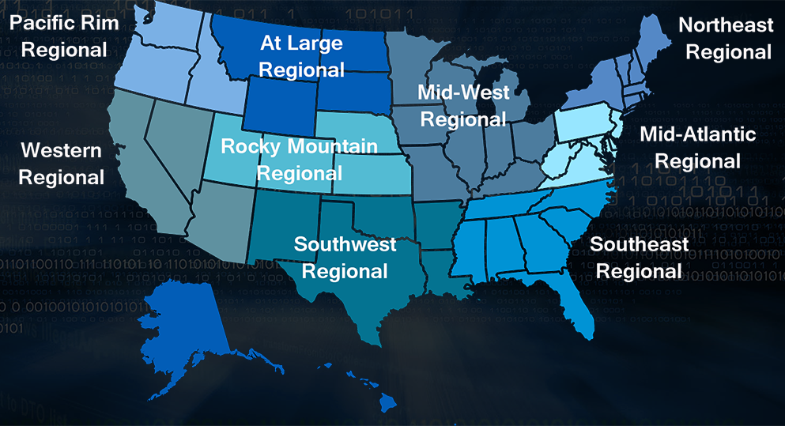

:author: Rob Fuller
:title: How to Win CCDC

// Reveal.js Config
:revealjsdir: revealjs
:backend: revealjs
:revealjs_slideNumber: true
:revealjs_transition: convex 
:revealjs_previewLinks: true
:revealjs_history: true

== How to Win CCDC

Press 's' to show speaker notes...

* Repo - https://github.com/mubix/howtowinccdc/
* Wiki - http://howtowinccdc.com/wiki/

[NOTE.speaker]
--
CCDC has both positive and negative effects on those competing on both the red and blue team (student defensive teams) sides. The positives are:
quick priority based problem solving
access and on-the-job training with enterprise grade infrastructure and defensive technologies
access to industry talent and contacts to hiring firms
However, there is a lack of realism that, no fault to CCDC staffers, is impossible to virtualize or simulate, which can lead to misconceptions on both sides if the players are unaware of it. Budgets, vast array of software/technology solutions,  large user base and large infrastructure are just some of the scale issues that CCDC is faced with simulating. For instance, a defender can very easily pinpoint a new service on a system if it's the only one they need to touch during the competition. And creating policies and procedures around that foundation can lead to problems on-the-job.

With the addition of the "cloud" to Nationals, and Mid-Atlantic’s SCADA systems  this is coming closer to reality but still needs to be addressed to both the student and red team population at these events. IMHO --mubix
--

== Year(s) in Review

== What Blue Teams do wrong...

* Get frustrated
* Think that injects need to be 100%
* Don't ask enough questions
* Leave default credentials
* Patch too much

[NOTE.speaker]
--
* White/Black/Orange whatever rainbow color teams the particular competition has, they are there to support you. Ask lots of questions.
* Leaving default credentials aren't just at the OS level. Web applications, databases, and other applications are just as important.
* Patching should be extremely targeted. Only patch what can be used for code execution. Check Metasploit, ask on Twitter, Reddit, etc, prepare yourself.
--

== Common misconceptions of the Red Team

* You use 0days! - Not usually
* You have a head start! - Nope
* You have advanced tools!
** sure.. if you call RDP advanced..

[NOTE.speaker]
--
* First, 0days are worth money. Very few Red Teamers are going to drop 0days at a competition for free. Second, real world companies have to figure out how to deal with 0days.
* Most of the regions give the Red Teams not only the exact same start time, but much less information about the network they are going up against. You have the biggest advantage here.
* The Red Team's only advantage is the ability to prepare ahead of time. Don't get me wrong, it's a huge advantage due to the fact that Blue Teams' can't bring anything in. However, to make tools that can withstand Blue Teams staring straight at them it takes months of development. There really isn't a fair answer here.
--

== Practice and Preparation

[%notitle]
== Practice and Prep Notes 1

* Create a play-book
* Automate everything you can
* Have a copy for _every_ member 
** Even if it's not their focus area
* Have a list of shortened / easily typed URLs for everything

[NOTE.speaker]
--
--

[%notitle]
== Practice and Prep Notes 2

* Password sheets of easily typed, long, passwords
* Cheat sheets of useful commands
* List of known / standard users per OS
* List of known / standard services per OS

[NOTE.speaker]
--
--

== Mubix's Public Repos

?? Hasn't been updated since 2014. Will look into hosting updated files somewhere

== Know your team

== Roles and Chain of Command

* Team Captain
** Gopher
*** Firewall Admin
*** Linux Admin
*** Windows Admin
*** Web Admin
*** Incident Responder
*** Client Services

[NOTE.speaker]
--
--

== Team Captain Responsibilities

* Make sure everyone is focused on the most important tasks
* Coordinates interdisciplinary requirements
* Focuses on maximum completion of injects
* Answers to CEO
* Insures that nothing distracts other team members

[NOTE.speaker]
--
As the team captain your job is to keep the "business" running at let your team members focus on the technical pieces. You receive injects, check on their status, and turn them in. You answer Orange and CEO requests. Basically you are the funnel that keeps all outside noise from touching your team. 
--

== Gopher

* Get/Download anything needed
* Backup for when Team Captain isn't present
* Backup for one of the base billets

[NOTE.speaker]
--
While this usually ends up as someone who is skilled in one of the base billets (Linux, Windows, Firewalls etc), they also have to know when to step in to assist the Team Captain.
--

== Firewall Admin

* http://howtowinccdc.com/wiki/#Firewall
* RAISE SHIELD Mr Sulu!!
* Egress and Ingress filter _quickly_

[NOTE.speaker]
--
* CAPRICA (ACL Generator) is _AWESOME_: https://github.com/google/capirca 
--

== Linux Admin

* http://howtowinccdc.com/wiki/#Linux

[NOTE.speaker]
--
--

== Windows Admin

* http://howtowinccdc.com/wiki/#Windows

[NOTE.speaker]
--
--

== Web Admin

* http://howtowinccdc.com/wiki/#Web

[NOTE.speaker]
--
--

== Client Services

* http://howtowinccdc.com/wiki/#ClientServices

[NOTE.speaker]
--
--

== Incident Response

* http://howtowinccdc.com/wiki/#IR

[NOTE.speaker]
--
--

== Physical Space

* Go into blackout

[NOTE.speaker]
--
--

== Injects

* http://howtowinccdc.com/wiki/#Injects

[NOTE.speaker]
--
--

== Know your network

* 

[NOTE.speaker]
--
--

== Know your defences

* 

[NOTE.speaker]
--
--

== Know your enemy

* 

[NOTE.speaker]
--
--

== Regional Specific Notes

Down Arrow...

=== Pacific Rim Region

=== Western Region

=== North-Central Region

=== Rocky-Mountain Region

=== At-Large Region

=== North-East Region

=== Mid-Atlantic Region

* Scores are ordinal (1st in category get 1 point, 8th, 8)
* Team Captains that go into CEO meetings with statistics like # of services online, # of injects competed, usually have better meetings

=== South-East Region

== Nationals Red Team Debrief

* 2017: https://www.youtube.com/watch?v=2vfjqR2amPs

== Questions?

* Rob Fuller
* mubix@hak5.org
* Twitter: @mubix
* https://malicious.link/

[NOTE.speaker]
--
Special thanks to Devon, Joseph, Marco, Aaron, Raymond, and Brian for the 1 AM jam session to get these slides together. Go social media.
Alex Herrick for GPOs and other suggestions
Craig Balding for the beautiful 'iptstate' command
--